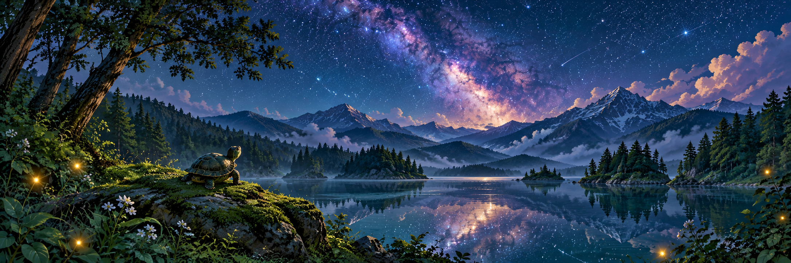
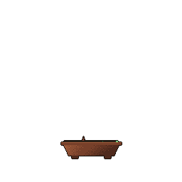

# Hi👋! I'm KitCatasha 🐢

  

## About Me

I'm Natasha, also known as KitCatasha, a Master's student in Computational Biology and Bioinformatics at the University of Göttingen, with a background in Biological Chemistry.

I use Python and R to explore biological data. My projects include multi-objective feature selection for omics and ATAC-seq analysis, and I'm interested in how machine learning can help us understand health and disease.

I also love bringing new ideas to life through web design, apps, and creative projects. Beyond the code, I enjoy painting, creating cinematic travel photos and videos, and going on adventure side quests. Nature, new places, and starry skies...love them because Allah created this beauty! 🌿🎨📸🌌

## Tools I Use & Explore

**Research & data analysis**

**Web & app development**

## Featured Projects

### 🔬 EMOO-FS
Multi-objective feature selection for omics data, balancing predictive performance with the number of selected features.

[Explore the repository →](https://github.com/KitCatasha/emoo-fs)

### 🌿 NÜGEL Website
A product website for NÜGEL, combining my interest in web design with building a practical website using Next.js.

[Explore the repository →](https://github.com/KitCatasha/nugel-website)

## My Interests

- 💻 Designing & building new projects
- 🎨 Painting, arts & crafts
- 🚴 Badminton, cycling & travel
- ✨ Anime & imaginative worlds

## Let's Connect

I’m always excited and open to connecting with anyone with similar interests. Let's exchange ideas and create something new!

## Fun Facts About Me

- I love turtles
- I have explored 20 countries so far
- Always trying out new skills
- I used to have 18 cats

## My Little Coding Garden 🌱

A little tree shaped by my GitHub journey.

  

  <a href="https://github.com/egorthinks/git-bonsai">Grown with Git Bonsai</a>

Thanks for visiting my profile. I hope we can connect!

---

<!---
KitCatasha/KitCatasha is a ✨ special ✨ repository because its `README.md` (this file) appears on your GitHub profile.
You can click the Preview link to take a look at your changes.
--->
